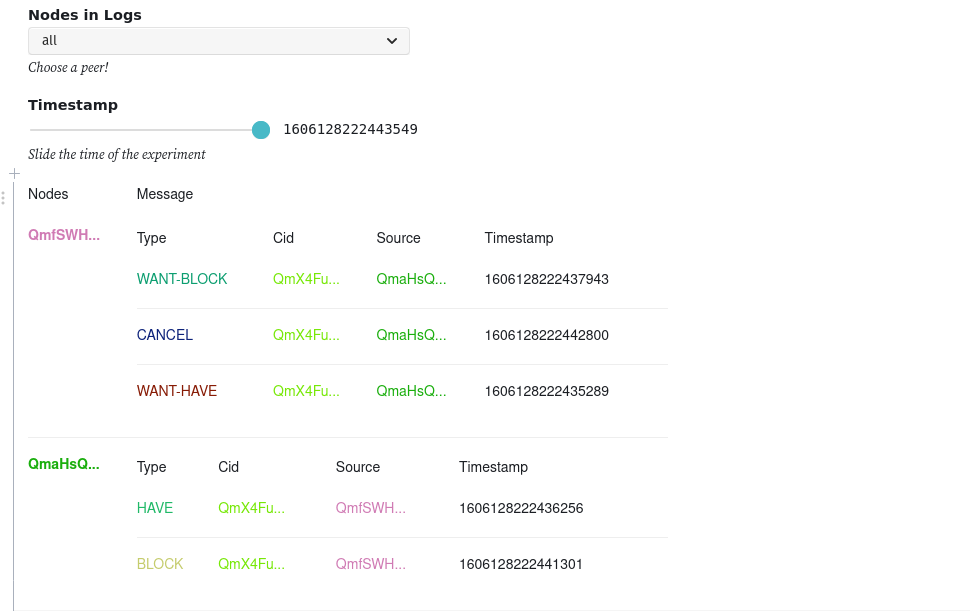

# Bitswap Viewer
The tool uses an ObservableHQ notebook and Jaeger to collect logs from an instrumented `go-bitswap` implementation, and visualize the flow of messages exchanged in an execution of the protocol.
https://observablehq.com/@adlrocha/bitswap-viewer


## Installation

### Using instrumented Bitswap implementation.
To use the instrumented implementation of Bitswap in your IPFS node or the environment where you are running `go-bitswap` point to the following fork adding a `replace` directive to your `go.mod`:
```
replace github.com/ipfs/go-bitswap => github.com/adlrocha/go-bitswap 1e2319bd190f17f5455fea7bb73dbd6d2af815f8
```
The Beyond Bitswap [probe](../probe) has been configured to point to this fork by default, so any execution of the probe is automatically traced.

### Installing Jaeger and making it available from ObservableHQ
To collect the traces from the instrumented Bitswap execution you need to have a local Jaeger environment up and running. All the code assumes that you have `jaeger-all-in-one` running locally with the default configurations. You can find the installation instructions for Jaeger [here](https://www.jaegertracing.io/docs/1.19/getting-started/).

Finally, in order to be able to retrieve the local logs collected by Jaeger in the ObservableHQ, you need to run a local proxy server between Jaeger and the notebook with CORS enabled. This repo includes a simple implementation of a proxy server in `server.js`. You can run it easily using NodeJS:
```
$ node ./server.js
```
(Any other proxy server that interfaces Jaeger with the ObservableHQ notebook so that CORS can be enabled would do the work).

## Usage
To use the tool be sure that you have Jaeger and the proxy server running.
```
$ ./jaeger-all-in-one
$ node server.js
```
You can run a simple file exchange between two nodes using the probe to collecte some logs in Jaeger. You can check if some logs have been collected by the execution by going to http://localhost:16686.

If can see Bitswap logs in the Jaeger UI it means you have everything ready to start seeing messages flow in the ObservableHQ: https://observablehq.com/@adlrocha/bitswap-viewer

Move the timestamp slider right and left to observe step-by-step how messages flow between nodes.
